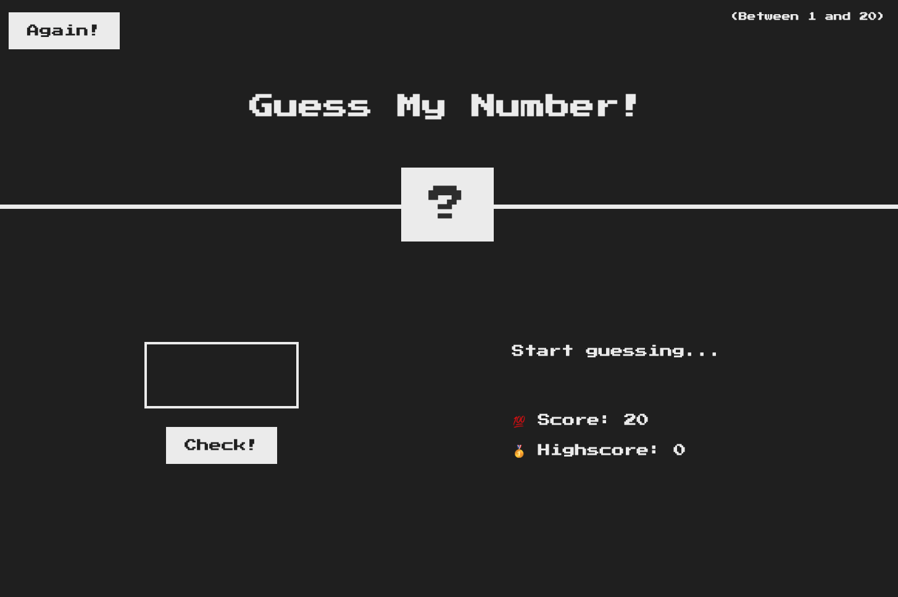
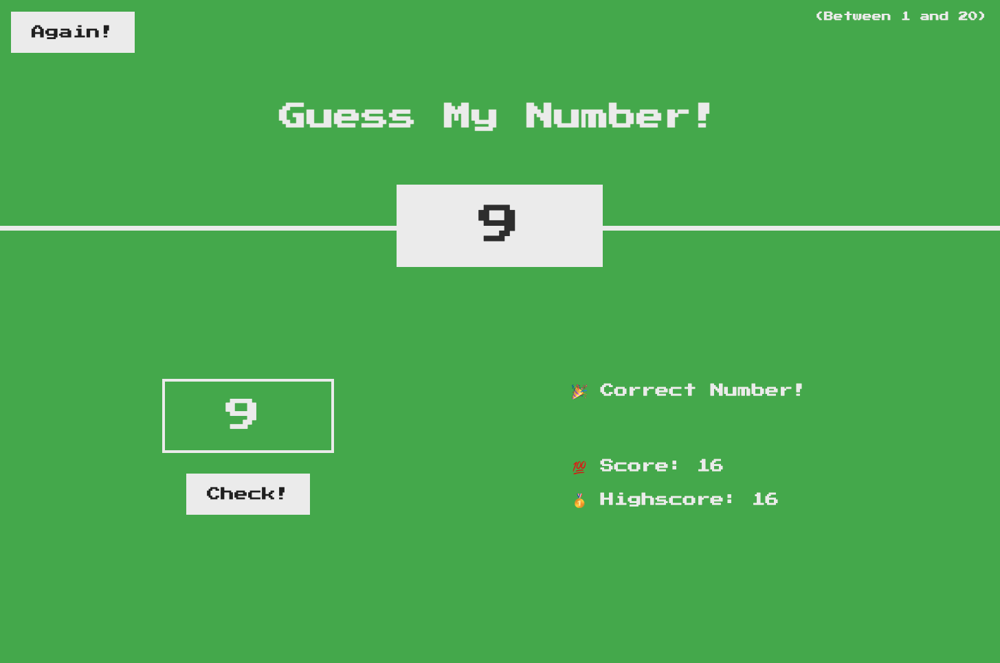

# Guess-my-number

## To run the project

1.git clone https://github.com/SophieLi0720/Guess-my-number.git -- to the desired local folder.

2.Open index.html with Google Chrome.

3.Interact with the UI by typing a number in the input box and clicking the "check" button.

4.Restart the game by clicking the "Again" button.

## The UI looks like...

